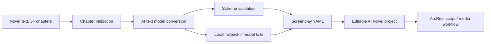

# AI Novel

AI Novel is an AI-assisted novel-to-screenplay workspace. It turns long-form
novel text with at least three chapters into an editable structured screenplay
draft in YAML, so authors can quickly move from prose to scenes, characters,
dialogue, actions, and production-ready story units.

The project is based on ArcReel and keeps the useful production workflow pieces:
project management, custom model providers, text/image/video generation routing,
asset management, and a browser workspace. The first screen has been redesigned
as an AI Novel landing page, and the core conversion flow now prioritizes an AI
text model while keeping a local fallback generator.

## Features

- Convert novels with 3+ chapters into structured screenplay YAML.
- Detect source chapters and preserve chapter references in the output.
- Generate screenplay fields for characters, scenes, dialogue, actions,
  location, time, summaries, and source chapter mapping.
- Create an AI Novel project from the generated YAML.
- Export an ArcReel-compatible episode script from the screenplay draft.
- Configure OpenAI-compatible custom providers for text and image models.
- Use an AI-first conversion path with a local fallback when the model provider
  is unavailable or out of balance.
- Includes a YAML Schema design document at
  `docs/ai-novel-yaml-schema.md`.

## Current AI Novel Flow



## Tech Stack

- Backend: Python 3.12, FastAPI, SQLAlchemy, Pydantic, PyYAML
- Frontend: React 19, TypeScript, Vite, Tailwind CSS
- Model routing: built-in providers plus OpenAI-compatible custom providers
- Storage: SQLite by default under `projects/.arcreel.db`

## Quick Start

### 1. Install Python dependencies

This repository is designed for Python 3.12+.

```bash
python -m venv .venv
.venv/Scripts/python -m pip install -e ".[dev]"
```

On macOS or Linux, use:

```bash
python -m venv .venv
. .venv/bin/activate
pip install -e ".[dev]"
```

### 2. Install frontend dependencies

```bash
cd frontend
pnpm install
cd ..
```

### 3. Run the local server

For local preview without login:

```bash
AUTH_ENABLED=false .venv/Scripts/python -m uvicorn server.app:app --host 127.0.0.1 --port 1241
```

On Windows PowerShell:

```powershell
$env:AUTH_ENABLED="false"
.\.venv\Scripts\python.exe -m uvicorn server.app:app --host 127.0.0.1 --port 1241
```

Open:

```text
http://127.0.0.1:1241/app/projects
```

## Configure Models

AI Novel supports custom OpenAI-compatible model providers.

In the app, open Settings and add a custom provider:

- Discovery format: `openai`
- Base URL: your provider `/v1` endpoint
- Text model endpoint: `openai-chat`
- Image model endpoint: `openai-images`

For the current local setup, the configured routing uses:

- Text: `custom-1/gpt-5.4`
- Image: `custom-1/gpt-image-2`

Do not commit API keys. Runtime credentials are stored in the local SQLite
database and are ignored by Git through `.gitignore`.

## API Endpoints

AI Novel exposes these backend endpoints:

- `POST /api/v1/ai-novel/validate-chapters`
- `POST /api/v1/ai-novel/convert`
- `POST /api/v1/ai-novel/projects`

Example conversion payload:

```json
{
  "title": "Rain Theater",
  "source_text": "Chapter 1: ...\nChapter 2: ...\nChapter 3: ...",
  "target_format": "short drama",
  "language": "zh-CN"
}
```

The response includes:

- `screenplay`: structured JSON payload
- `yaml_text`: editable screenplay YAML
- `chapter_count`: detected source chapter count

## YAML Schema

The screenplay YAML schema is documented in:

```text
docs/ai-novel-yaml-schema.md
```

The schema is intentionally author-friendly:

- `source_chapters` keeps traceability back to the novel.
- `characters` gives stable IDs for scenes and dialogue.
- `scenes` is the editing center of the draft.
- `dialogues` separates spoken lines from action.
- `actions` keeps visual and performance beats easy to revise.

The design favors structured editing over one-shot prose output, because authors
need a draft they can refine, not a locked final script.

## Development Checks

Run backend tests:

```bash
.venv/Scripts/python -m pytest tests/test_ai_novel_service.py tests/test_ai_novel_router.py tests/test_projects_router.py -q
```

Run backend lint:

```bash
.venv/Scripts/ruff.exe check server/ai_novel.py server/routers/ai_novel.py tests/test_ai_novel_service.py tests/test_ai_novel_router.py
```

Run frontend tests:

```bash
cd frontend
pnpm test src/components/pages/AINovelCreatePage.test.tsx src/router.test.tsx -- --runInBand
```

Build frontend:

```bash
cd frontend
pnpm build
```

## Security Notes

- Never commit `.env`, `projects/.arcreel.db`, `projects/`, `logs/`,
  `frontend/node_modules/`, or `frontend/dist/`.
- Keep API keys in environment variables or the app's local provider settings.
- If a key has been pasted into chat or logs, rotate it before production use.
- The AI-first conversion path falls back to local generation if the provider
  returns an error such as insufficient balance.

## License

This project is derived from ArcReel. Keep the upstream license terms in mind
when publishing or distributing modified versions. See `LICENSE`.
